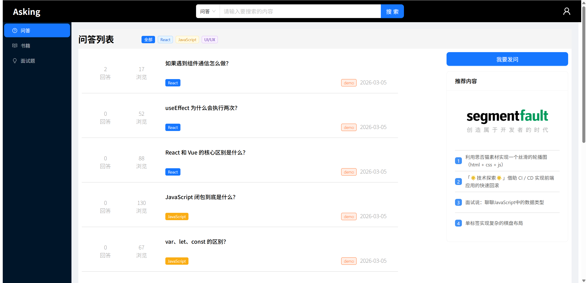
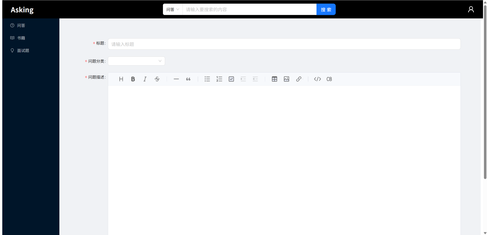
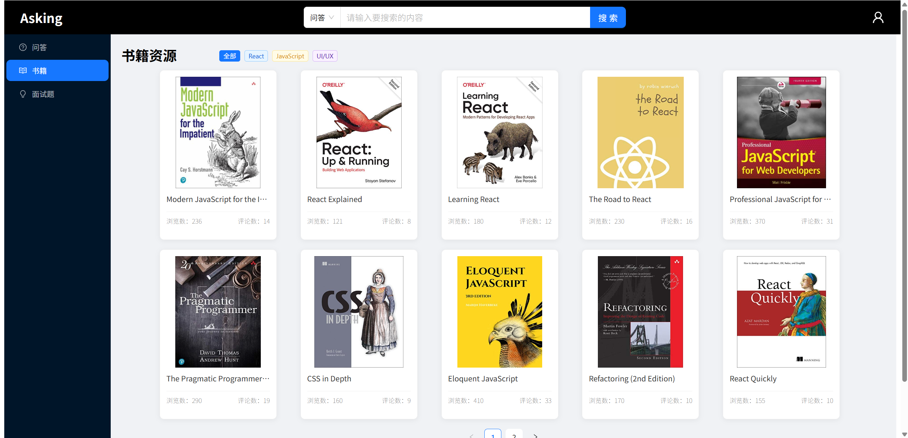
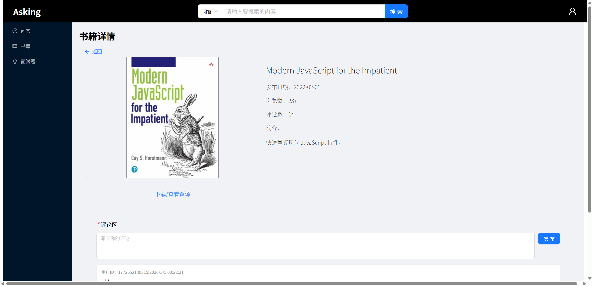
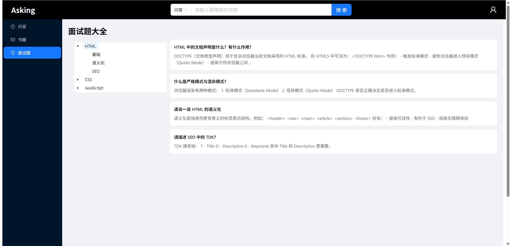
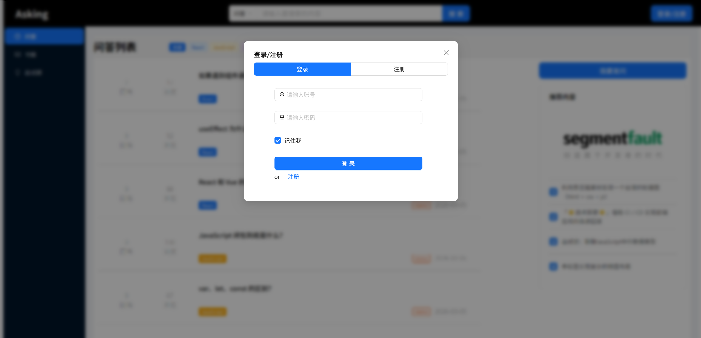

# Asking 技术社区问答平台

一个基于 **React + Vite** 开发的技术社区问答平台，用户可以浏览技术问题、搜索内容，并查看相关书籍信息

## 在线访问

项目已部署到 Vercel：

https://asking-five.vercel.app

## 项目简介

本项目是一个技术社区的前端项目，主要实现了技术问答列表展示、书籍推荐、搜索等功能。通过该项目练习了 React 项目结构设计、组件拆分以及前端项目部署流程。
主要功能

* 问答列表展示

* 技术问题搜索

* 书籍内容展示

* 页面分页

* 响应式页面布局

技术栈
---

* React

* Vite

* JavaScript

* CSS

* Ant Design

## 项目截图

# 

